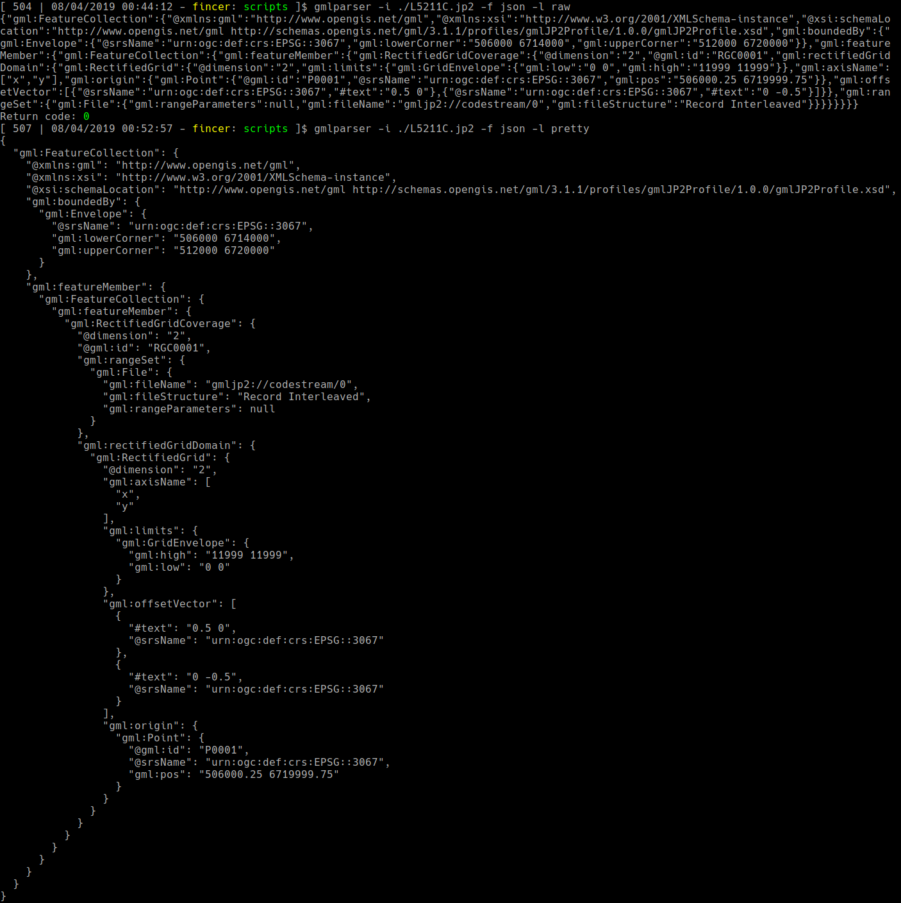
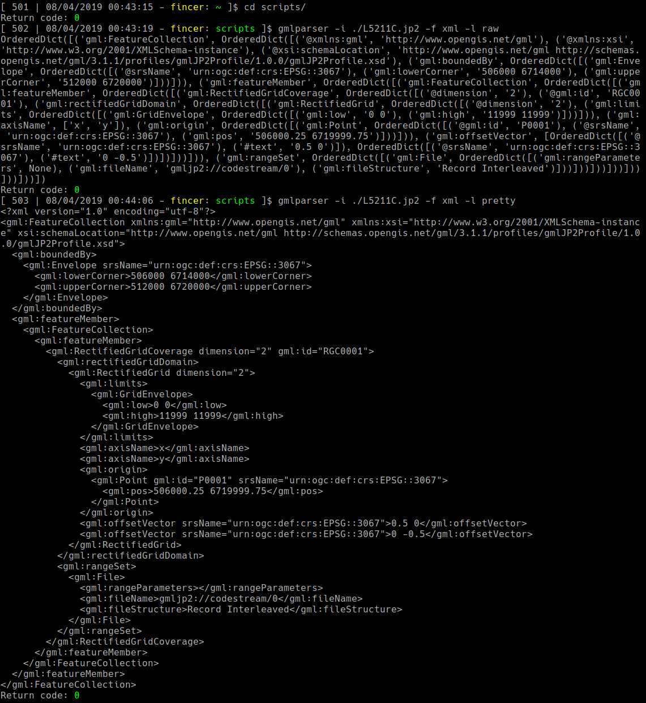
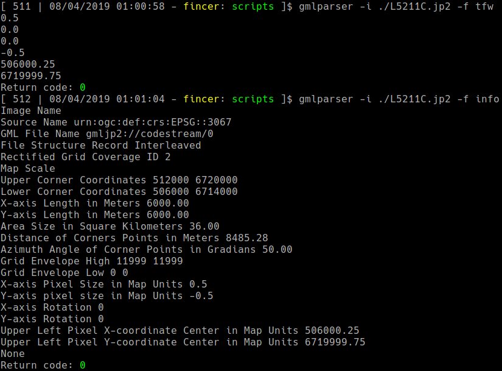

# GML data parser for JPEG2000 files

Simple JPEG2000 GML data parser / extractor, _without additional tools such as GDAL_. Just pure Python 3.

## Requirements

## Usage

File: [gmlparser.py](data/gmlparser.py)

```
usage: gmlparser.py [-h] [-i [INPUTFILE]] [-f [OUTPUTFORMAT]]
                    [-o [OUTPUTFILE]] [-l [FORMATTING]]

optional arguments:
  -h, --help            show this help message and exit
  -i [INPUTFILE], --input [INPUTFILE]
                        Input JPEG2000 image file
  -f [OUTPUTFORMAT], --dataformat [OUTPUTFORMAT]
                        Output format (Default: xml; Available: xml | json |
                        [tfw|worldfile] | info)
  -o [OUTPUTFILE], --output [OUTPUTFILE]
                        Output file name
  -l [FORMATTING], --formatting [FORMATTING]
                        Data formatting (Default: raw; Available: raw |
                        pretty)

```

### Examples (commands + output):

**JSON:**



**XML:**



**TFW + info:**



## License

This repository uses GPLv3 license. See [LICENSE](LICENSE) for details.
